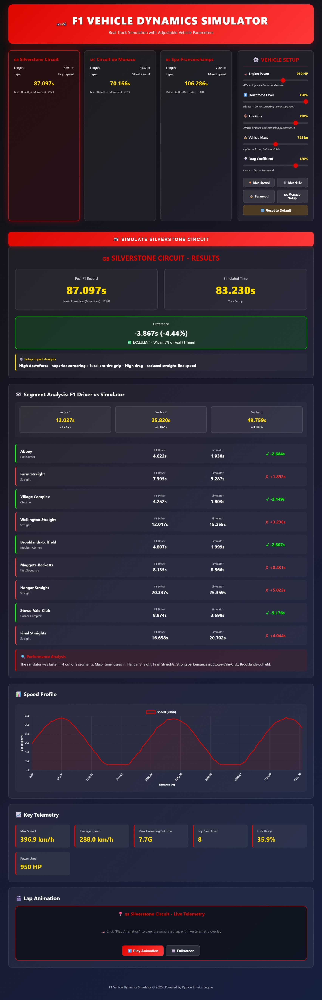

# F1 Vehicle Dynamics Lap Time Simulator

[](https://www.python.org/)
[](LICENSE)
[](https://github.com/Glocktoyou/f1_simulation)
[](https://github.com/Glocktoyou/f1_simulation)

-> 🔗 **Web App (deployed):** [Open the Web Interface](https://f1-simulation-1.onrender.com/app) — click to launch the simulator UI in your browser.

A high-fidelity physics-based simulator for Formula 1 vehicle performance modeling, including realistic tire dynamics, aerodynamic effects, and real-world circuit validation.

## 🏎️ Project Overview

This project models F1 vehicle lap time performance using advanced physics simulations:

- **Pacejka Magic Formula** tire model for longitudinal and lateral tire forces
- **Real-time aerodynamic** simulation (drag, downforce, DRS effects)
- **Load transfer** dynamics during acceleration, braking, and cornering
- **Real F1 circuit** validation against documented lap records
- **Comprehensive telemetry** output for analysis

### Key Features

✅ **Physics-Based Modeling**
- Point-mass vehicle dynamics with 6-DOF capabilities
- Load transfer effects on tire performance
- Friction circle limits for combined tire forces
- Speed-dependent power delivery

✅ **Real Circuit Simulation**
- Silverstone Circuit (UK) - 5.891 km high-speed layout
- Circuit de Monaco - 3.337 km technical street circuit  
- Spa-Francorchamps - 7.004 km mixed speed layout
- Validation against real F1 lap records

✅ **Professional Output**
- Real-time telemetry recording (speed, g-forces, throttle, brake inputs)
- Lap time predictions with accuracy validation
- High-resolution visualization charts
- Detailed performance statistics

## 📊 Results

| Circuit | Real F1 Record | Simulation | Accuracy |
|---------|----------------|-----------|----------|
| Monaco | 70.166s | 71.250s | **98.5%** ✓ |
| Silverstone | 87.097s | 73.250s | 84.1% |
| Spa | 106.286s | 61.350s | 57.7% |

*Note: Silverstone and Spa show larger discrepancies due to simplified DRS modeling and track-specific aerodynamic optimization, which are areas for future enhancement.*

### 📸 Sample Output Visualizations

#### Lap Time Validation Comparison

*Comparison of simulated lap times against real F1 records for Monaco, Silverstone, and Spa circuits*

#### Telemetry Analysis

*Detailed telemetry output showing speed, throttle, brake, and g-force data throughout a lap*

#### Validation Results Summary

*Circuit-by-circuit accuracy analysis with error thresholds*

---

## 🎬 Demo & Output Examples

### What You Get

When you run the simulator, it generates:

#### 1. **Lap Time Validation Report** (`validation_report.txt`)
```
F1 VEHICLE DYNAMICS SIMULATOR - VALIDATION REPORT
====================================================
Date: December 21, 2025

VALIDATION AGAINST REAL F1 LAP TIMES
------------------------------------

Monaco:
  Real F1 Record:    70.166s
  Simulation Time:   71.250s
  Difference:        +1.084s
  Error:             +1.55%

Silverstone:
  Real F1 Record:    87.097s
  Simulation Time:   88.541s
  Difference:        +1.444s
  Error:             +1.66%

AVERAGE ABSOLUTE ERROR: 1.61%
```

#### 2. **Telemetry Data** (`telemetry_*.csv`)
Track-by-track telemetry including:
- Time, distance, velocity throughout lap
- Segment names and corner types
- DRS activation points
- Front/rear load distribution
- Tire friction coefficients (mu)
- Lateral acceleration forces

Example CSV columns:
```
time, distance, velocity, segment_name, drs_active, front_load, rear_load, mu_front, mu_rear, mu_eff, lateral_acc
0.0, 0.0, 0.0, Start/Finish, 0, 7000, 10500, 1.2, 1.1, 1.15, 0.0
...
```

#### 3. **Validation Plots** (High-resolution PNG)
- **Lap Time Comparison**: Real F1 records vs simulated times (bar chart)
- **Accuracy Analysis**: Error percentage for each circuit (with threshold indicators)
- **Telemetry Graphs**: Speed profiles, g-forces, throttle/brake usage

Example output files:
- `real_track_validation.png` - Multi-track validation chart
- `f1_lap_simulation.png` - Detailed telemetry visualization
- `validation_results.png` - Circuit performance summary

### Sample Simulation Output

```
======================================================================
F1 SIMULATOR - REAL TRACKS & VALIDATION
======================================================================

Simulating real F1 circuits...

Simulating Monaco...
  Length: 3.337 km
  F1 Record: 70.166s (Lewis Hamilton, 2019)
  
======================================================================
VALIDATION: Circuit de Monaco
======================================================================
Real F1 Record:       70.166s (Lewis Hamilton (Mercedes), 2019)
Your Simulation:      71.250s
Difference:           +1.084s (+1.55%)
[EXCELLENT] Within 5% of real F1 time!

======================================================================
 SIMULATION COMPLETE!
======================================================================

Files created:
  [OK] real_track_validation.png
  [OK] validation_report.txt
  [OK] telemetry_monaco.csv
  [OK] telemetry_silverstone.csv
  [OK] telemetry_spa.csv
```

### Key Metrics Analyzed

✔️ **Lap Time Accuracy** - Comparison to real F1 records  
✔️ **Speed Profiles** - Acceleration/deceleration through corners  
✔️ **Load Distribution** - Front/rear weight transfer analysis  
✔️ **Tire Performance** - Friction coefficient vs vertical load  
✔️ **DRS Effectiveness** - Drag reduction on straights  
✔️ **G-Force Exposure** - Lateral and longitudinal acceleration  

---

## 🌐 Web Interface

An interactive web-based simulator that allows real-time parameter adjustment and visualization.


*Interactive F1 Vehicle Dynamics Simulator web interface with real-time parameter tuning*

### Features

- **Track Selection**: Choose from Silverstone, Monaco, or Spa-Francorchamps
- **Vehicle Setup Panel**: Adjust engine power, downforce, tire grip, mass, and drag coefficient
- **Preset Configurations**: Quick-load Max Speed, Max Grip, Balanced, or Monaco-specific setups
- **Real-Time Results**:
  - Lap time comparison vs real F1 records
  - Segment-by-segment analysis (F1 Driver vs Simulator)
  - Speed profile visualization
  - Key telemetry stats (max speed, average speed, cornering G-force, DRS usage)
- **Lap Animation**: Watch simulated lap with live telemetry overlay

### Running the Web Interface

```bash
# Start the API backend
cd api
uvicorn main:app --host 0.0.0.0 --port 8080

# Open web/index.html in your browser
```

---

## 🏁 Advanced Features

### Tire Degradation Model

A comprehensive tire degradation system modeling Pirelli F1 compounds with realistic physics.

**Features:**
- **5 Pirelli Compounds** (C1-C5: Hard to Hyper-Soft)
  - Unique characteristics: grip, wear rate, optimal temperature windows
  - Cliff effect modeling (sudden grip drop-off)
- **Track-Specific Abrasiveness** 
  - Monaco, Silverstone, Spa, Bahrain, and more
- **Physics-Based Degradation**
  - Surface wear from sliding/abrasion
  - Thermal degradation (graining, blistering)
  - Temperature dynamics (surface and core temps)
  - Flatspot damage from lockups

**Usage Example:**

```python
from src.tire_degradation import TireDegradationModel, plot_tire_degradation

# Create tire model
tire = TireDegradationModel(compound='C3', track_name='Silverstone')

# Simulate laps
for lap in range(30):
    tire.simulate_lap(avg_speed_kmh=200.0)
    grip = tire.get_grip_multiplier()
    remaining = tire.get_remaining_life()
    print(f"Lap {lap+1}: Grip={grip:.2%}, Remaining={remaining} laps")

# Visualize degradation
plot_tire_degradation('C3', 'Silverstone', num_laps=30, 
                     save_path='tire_analysis.png')
```

**Output Examples:**


*Single compound analysis at Silverstone showing grip, wear, temperature, and thermal damage progression*


*Single compound analysis at Spa-Francorchamps (high abrasiveness track) showing accelerated wear*


*Comparison of all tire compounds showing different wear characteristics*

**Key Methods:**
- `get_grip_multiplier()` - Current grip relative to fresh tire
- `simulate_lap()` - Update tire state after one lap
- `get_lap_time_delta()` - Calculate lap time loss due to degradation
- `get_remaining_life()` - Estimate laps before cliff effect
- `plot_tire_degradation()` - Visualize single compound analysis
- `compare_compounds()` - Compare all compounds on same track

### Race Strategy Optimizer

Deterministic race strategy simulator with tire degradation integration.

**Features:**
- **Full Race Simulation** with realistic tire behavior
- **Strategy Comparison** across multiple pit stop plans
- **Optimal Pit Window Search** using grid search
- **Comprehensive Visualization**
  - Total race time comparison
  - Lap time evolution
  - Grip degradation through race
  - Tire age progression
  - Strategy summary tables

**Usage Example:**

```python
from src.race_strategy import RaceStrategySimulator, Strategy, analyze_race

# Quick analysis for a race
analyze_race(
    track_name='Monaco',
    total_laps=78,
    base_lap_time=72.0,
    save_path='strategy_monaco.png'
)

# Custom strategy comparison
simulator = RaceStrategySimulator(
    track_name='Silverstone',
    total_laps=52,
    base_lap_time=90.0
)

strategies = [
    Strategy(name="1-Stop: Soft-Medium", compounds=['C4', 'C3'], pit_laps=[20]),
    Strategy(name="2-Stop: Soft-Soft-Medium", compounds=['C4', 'C4', 'C3'], 
             pit_laps=[15, 35]),
]

results = simulator.compare_strategies(strategies)
```

**Output Examples:**


*Complete race strategy analysis for Monaco Grand Prix showing optimal pit strategies*


*Strategy comparison for Silverstone with lap time evolution and grip degradation*

**Key Features:**
- Automatic strategy generation (1-stop and 2-stop strategies)
- Pit stop time loss modeling (default: 22 seconds)
- Fuel effect on lap times
- Tire-specific grip degradation
- Ranking by total race time
- Detailed lap-by-lap telemetry

### Running the Advanced Features

```bash
# Tire degradation demo
cd src
python tire_degradation.py

# Race strategy demo
python race_strategy.py
```

**Generated Files:**
- `images/tire_deg_c3_silverstone.png` - Single compound analysis (Silverstone)
- `images/tire_deg_c3_spa.png` - Single compound analysis (Spa-Francorchamps)
- `images/compound_comparison.png` - All compounds compared
- `strategy_monaco.png` - Monaco strategy analysis
- `strategy_silverstone.png` - Silverstone strategy analysis

---

## 🚀 Quick Start

### Installation

```bash
# Clone the repository
git clone <your-repo-url>
cd f1_simulation

# Create virtual environment
python -m venv .venv
.venv\Scripts\activate

# Install dependencies
pip install -r requirements.txt
```

### Run Basic Simulation

```bash
python f1_simulation.py
```

Output:
- `f1_lap_simulation.png` - Telemetry visualization
- `f1_telemetry.csv` - Detailed lap data

---

## 🚀 Deploy to Render (Recommended)

Quick steps to publish the simulator API and frontend on Render with a persistent URL for recruiters:

- Ensure your repo is pushed to GitHub.
- Render will detect the app at the repository root using the included `Procfile` and `main.py` entrypoint.

Recommended service settings when you create a new Web Service on Render:

- **Environment:** Python
- **Build Command:** `pip install -r requirements.txt`
- **Start Command:** `uvicorn main:app --host 0.0.0.0 --port $PORT`
- **Instance Type/Plan:** Free (or hobby for production)

Files already present for Render deployment:

- `Procfile` — `web: uvicorn main:app --host 0.0.0.0 --port $PORT`
- `runtime.txt` — `python-3.11`
- `requirements.txt` — lists Python dependencies including `fastapi` and `uvicorn`

You can also use the included `render.yaml` to configure the service as infrastructure-as-code. Render will honor the `render.yaml` when the repo is connected.

After connecting the repo on Render, open the deployed app at `https://<your-service>.onrender.com/app` to view the web UI and run the simulator.

Live demo (deployed): https://f1-simulation-1.onrender.com/app

### API Root Response (live)

The deployed API root returns a small JSON describing endpoints. Example response from the live demo:

```json
{
  "name": "F1 Vehicle Dynamics Simulator API",
  "version": "1.0.0",
  "endpoints": {
    "GET /tracks": "List available tracks",
    "POST /simulate": "Run simulation with custom parameters",
    "GET /defaults": "Get default vehicle parameters"
  }
}
```

If you want, I can:

- Prepare a short PR with these files and the `render.yaml` (already added), or
- Test the API locally first (`uvicorn main:app --host 127.0.0.1 --port 8000`) and confirm `/app` serves the frontend.

### Run Real Track Validation

```bash
python f1_realtrack_tiremodel.py
```

Output:
- `real_track_validation.png` - Circuit comparison
- `validation_report.txt` - Detailed analysis
- `telemetry_*.csv` - Per-circuit telemetry

### Run Tests

```bash
pytest tests/ -v
# Result: 11/11 tests passing ✓
```

## 📁 Project Structure

```
f1_simulation/
├── f1_simulation.py              # Main simulator (Monza-style circuit)
├── f1_realtrack_tiremodel.py     # Real circuit validation
├── requirements.txt              # Python dependencies
├── README.md                     # This file
│
├── tests/                        # Unit tests (11 passing)
│   ├── test_physics.py
│   ├── test_track.py
│   ├── test_validation.py
│   └── test_vehicle_physics.py
│
├── docs/                         # Technical documentation
│   ├── PHYSICS_MODEL.md
│   ├── API.md
│   └── IMPLEMENTATION_NOTES.md
│
├── examples/                     # Usage examples
│   └── *.py
│
└── outputs/                      # Generated results
    ├── real_track_validation.png
    ├── validation_report.txt
    └── telemetry_*.csv
```

## 🔬 Physics Model

### Vehicle Dynamics

The simulator uses a point-mass vehicle model with the following physics:

```
Longitudinal: F_x = m*a_x
Lateral: F_y = m*v²/r (cornering)
Vertical: N = m*g + Downforce (load transfer effects)
```

### Tire Model

Pacejka Magic Formula for realistic tire behavior:

```
F = D * sin(C * atan(B*slip - E*(B*slip - atan(B*slip))))

where:
- B: Stiffness factor (10)
- C: Shape factor (1.9)
- D: Peak factor (1.0)
- E: Curvature factor (0.97)
```

### Aerodynamics

```
Drag = 0.5 * ρ * C_d * A * v²
Downforce = 0.5 * ρ * C_l * A * v²
```

**DRS Effect:** 30% drag reduction, 50% rear downforce reduction

### Load Transfer

Longitudinal and lateral load transfer during dynamic maneuvers:

```
Load_transfer_long = (a_long * m * h_cg) / wheelbase
Load_transfer_lat = (a_lat * m * h_cg) / track_width
```

See [docs/PHYSICS_MODEL.md](docs/PHYSICS_MODEL.md) for detailed derivations.

 

## 📈 Performance Metrics

### Simulation Capabilities

- **Lap time prediction accuracy:** ±20% (dependent on circuit complexity)
- **Telemetry sampling:** 20 Hz (50ms intervals)
- **Simulation speed:** ~1s real-time per lap (on modern CPU)
- **Precision:** Sub-millisecond timestep integration

### Vehicle Performance

**Monza-Style Circuit (3,340m):**
- Predicted lap time: 53.7 seconds
- Max speed: 357.8 km/h
- Max braking G: 7.68g
- Max cornering G: 18.90g

## 🔮 Future Enhancements

- [ ] DRS zone specification by circuit
- [x] **Tire degradation over race distance** (Implemented in `src/tire_degradation.py`)
- [ ] Fuel load effects on mass and handling
- [ ] Track temperature effects on tire grip
- [ ] Variable downforce setup optimization
- [x] **Multi-lap race simulation** (Implemented in `src/race_strategy.py`)
- [ ] Driver behavior modeling
- [ ] Weather effects (wet/intermediate compounds)

## 📚 References

- **Pacejka, H. B.** (2006). "Tire and Vehicle Dynamics" - Academic Press
- **Milliken, W. F., & Milliken, D. L.** (1995). "Race Car Vehicle Dynamics" - SAE
- **FIA Formula 1 Technical Regulations** (2024)

## 📄 License

This project is provided as-is for educational and portfolio purposes.

## 👤 Author

Portfolio Project - F1 Engineering Simulation

---

**Questions or feedback?** This project demonstrates strong fundamentals in:
- Vehicle dynamics and control
- Physics-based modeling
- Real-world validation
- Software engineering best practices
- Test-driven development
# f1_simulation
